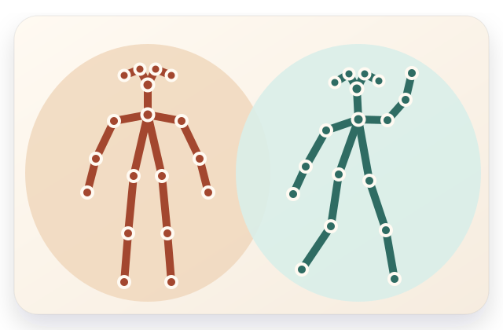
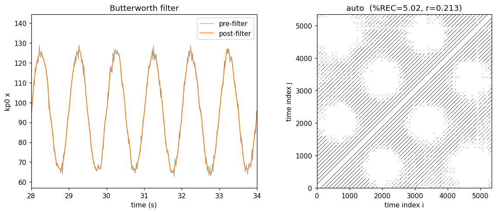

<p align="center">
  
</p>

# Pose-Dynamics

A reproducible pipeline for **analyzing movement from pose data** — from any 2D or
3D pose estimator. It takes frame-by-frame landmark trajectories and turns them into
interpretable measures of behaviour at three levels, which you can use together or
on their own:

- **Clean pose data** — confidence masking, principled interpolation, zero-phase
  filtering, and an explicit, reported gap policy. Stop here if all you need is
  conditioned trajectories.
- **Linear kinematics** — displacement, velocity, acceleration and their summaries
  (mean, SD, max, RMS): *how much* and *how fast* someone moves.
- **Recurrence analysis** — *how movement is organised
  in time* — its stability, coordination, and transitions, which amplitude measures
  cannot see.

The last two are the paper's two-level framing — movement **magnitude** vs.
**organization** — and are meant to be read together. It accompanies the methods
paper *Nonlinear Methods for Analyzing Pose in Behavioral Research* and implements
everything the paper describes, including the three case studies.

Every stage is **inspectable** — it returns an object you can plot and
sanity-check — because the primary interface is a notebook and the key parameter
choices are made by *you*, from evidence the framework presents.

<p align="center">
  
</p>

<p align="center"><em>Left: a preprocessing checkpoint (raw vs. filtered — smoothed, not flattened).
Right: the recurrence plot the analysis produces.</em></p>

## Quickstart (no Python required)

Install [Docker](https://docs.docker.com/get-docker/), then from this folder:

```bash
docker compose up          # first run builds the image (a few minutes)
```

Open the `http://127.0.0.1:8888/…` link it prints — it opens **straight to the
quickstart notebook**. Choose **Run ▸ Run All Cells** and read top to bottom: it
runs on bundled example data first, so you see it work before your own data is
involved, and it teaches you to read each checkpoint and choose the two parameters
the analysis needs.

**To use your own data:** drop your [canonical CSV files](docs/canonical_format.md)
into the `data/` folder next to this command (they appear in the notebook at
`/work/data/`), then change the one marked cell.

*Prefer Python?* `pip install pose-dynamics` (3.12+; needs a C/C++ compiler for the
`rqa-analysis` recurrence core), then open `notebooks/quickstart.ipynb`.

## Get features over a folder of CSVs — three commands

New here? **Start with the [Getting started guide](docs/getting_started.md).** It
walks the whole workflow: no notebook, no code — inspect your data, write a config,
run it over the folder.

```bash
pose-dynamics inspect  trial.csv     # 1. see your keypoints, labelled by index
pose-dynamics new-config study.yaml  # 2. write a config (declare the feature pipeline)
pose-dynamics run      study.yaml    # 3. features + metrics for the whole folder
```

This writes per-file **feature time series** and a tidy **metrics table** (magnitude
+ recurrence). Ready-to-edit config templates are in [`configs/`](configs/).

## Documentation

| Document | For |
|----------|-----|
| [Getting started](docs/getting_started.md) | The three-command workflow, writing a config, and choosing (τ, m) honestly. **Start here.** |
| [Canonical format](docs/canonical_format.md) | The one input format. Read this to bring your own data. |
| `notebooks/quickstart.ipynb` | Interactive: read each checkpoint and commit (τ, m) on one file. |
| `notebooks/run_dataset.ipynb` | The same run from a notebook (edit a config cell). |
| [Configuration reference](docs/configuration.md) | Every parameter, its default, units, and the paper's guidance. |
| [Feature steps](docs/feature_steps.md) | The steps a feature pipeline is built from, and how to add your own. |

## Citation

If you use this software, please cite the accompanying paper:

```bibtex
@article{posedynamics,
  title   = {Nonlinear Methods for Analyzing Pose in Behavioral Research},
  author  = {Sale, Carter, Macpherson, M.C., Patil, G., Miles, K., Wallot, S., Kallen, R.W., & Richardson, M.J.},
  year    = {2026},
  note    = {Software: https://github.com/<org>/pose-dynamics}
}
```

*(Fill in authors, venue, and DOI on publication.)*

## Scope and maintenance

**What it supports.** One input format (wide CSV, one file per person per trial;
2D or 3D and confidence inferred from the header). One in-memory model
(`PoseSequence`; 3D is not a special case, just `dims == 3`) and a `Dyad` container
for two-person analysis. Preprocessing (confidence masking, run-limited
interpolation, zero-phase filtering, explicit gap policy) usable on its own; linear
kinematic metrics (displacement/velocity/acceleration summaries) as a standalone
family; a composable feature-step library; framework-owned embedding selection
(AMI/FNN); and a thin wrapper over
[`rqa-analysis`](https://pypi.org/project/rqa-analysis/) for auto-, cross-, and
multivariate cross-recurrence. Each level is a valid entry point — you need not run
recurrence to use the rest. The three published case studies reproduce as worked
examples.

**What it does not.** It does **not** ingest arbitrary estimator outputs — you
convert to the canonical format once (example converters are in `examples/`, not
core code). It contains **no inferential statistics** — mixed-effects models,
effect sizes, and corrections live in the case-study notebooks, not the library,
keeping the core light. It is not a real-time system, does not perform pose
estimation, and does not auto-select embedding parameters: the paper argues
automated minimum-picking is unreliable, so the framework *presents evidence and
proposes*; the researcher commits (see the quickstart).

**Reproducibility & versioning.** Every result carries the full resolved
configuration that produced it, and every `PoseSequence` carries an ordered
provenance log of the stages applied. Regression tests pin each case study's
outputs so refactors cannot silently change published results. Releases follow
semantic versioning: patch = fixes, minor = additive/back-compatible, major =
breaking changes to the data model, config schema, or a case study's numbers. The
canonical format and `PoseSequence`/`Dyad` API are the stable public surface.

License: MIT.
